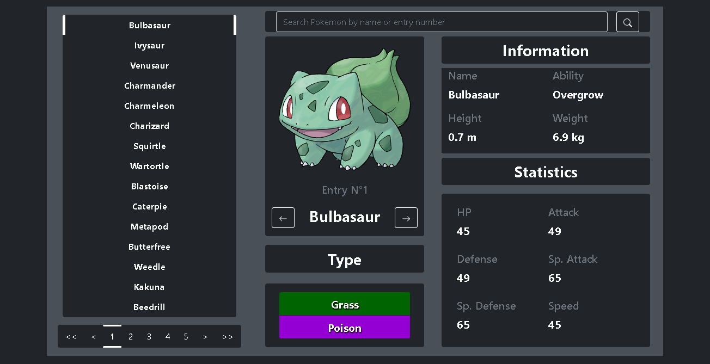

# Pokémon App

The following App consists of a Pokedex or Pokémon Encyclopedia, with it you can search a Pokémon by its name or its National Pokédex entry number. It also possesses a paginator that lets swipe through the different pokemon available and see some information about it. All the data consumed is provided by RESTful Pokémon API available here: [https://pokeapi.co/](https://pokeapi.co/).

## Getting started with this repository

To get started with this repository you may download a copy or run the following git command: `git clone https://github.com/Horacaz/pokedex-app`. Next, you need to install its dependencies with `npm install`. After the dependencies are correctly installed you need to run `npm run build` to compile the TypeScript source code to JavaScript. With the App already built you will lastly run `npm run start` to initialize a development server that will let you preview and use the App.

Preview of the scripts available

```
  "scripts": {
    "dev": "tsc -w",
    "build": "tsc",
    "postbuild": "copyfiles styles/* index.html dist/",
    "start": "http-server -c-1 dist/",
    "test": "jest src/",
    "prepare": "husky install",
    "style": "prettier src --write"
  },
```

## Tech Stack

This App was first developed using plain JavaScript and later migrated to TypeScript, there still some cleaning and tasks to tidy up the code a little more. It is styled with Bootstrap 5 and linted with tools like Eslint and Prettier. Unit test and E2E with Jest and Cypress were also done to improve the App sturdiness and flexibility. Following such objective, a GitHub Actions pipeline was implemented to ensure that any pushes and changes to the master branch were previously tested and linted to ensure the code's integrity. Husky was also implemented to run such tasks before every commit in every branch to ensure that any changes made are tested and previous features still work as intended.

## App Preview


